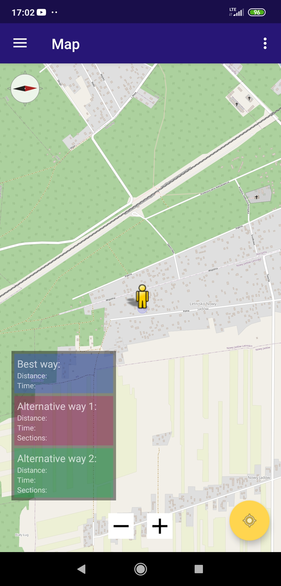
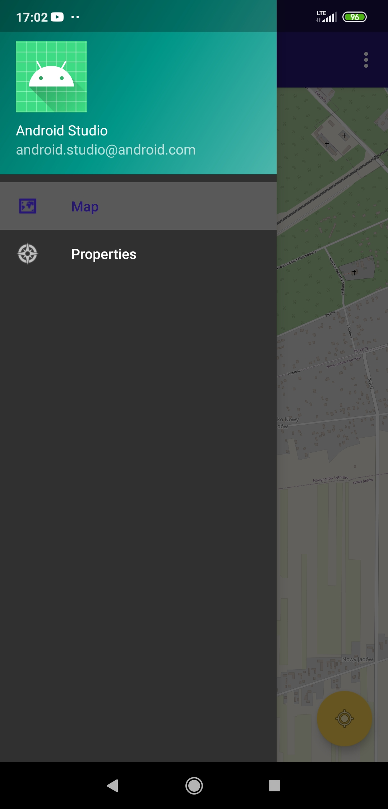
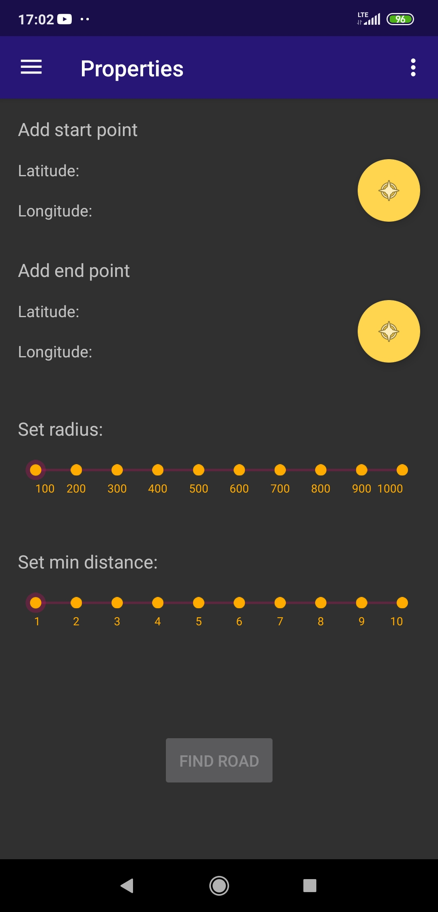
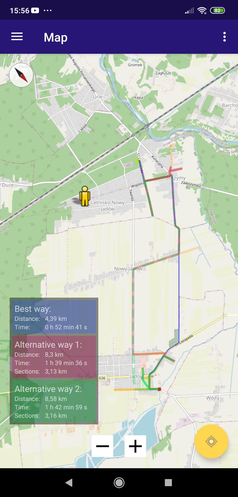

# Znajdowanie najlepszej trasy
## SPDB-Projekt-20L

### Wstęp
Celem projektu była implementacja aplikacji mobilnej do wyznaczania najlepszej trasy wg zadanych parametrów. Podstawową opcją dostępną dla użytkownika miała być możliwość wyboru najlepszej trasy ze względu na jej całkowity dystans. Ponadto aplikacja wyszukuje trasy zawierające zadaną minimalną długość tzw. “odcinków widokowych”.

### Architektura rozwiązania
Aplikacja składa się z dwóch activities.
- Pierwszym jest ekran powitalny widoczny po uruchomieniu aplikacji zawierający przycisk, który przekierowuje do głównego okna.
- Drugie to activity z left navigation drawer. Możliwe jest przełączanie się między widokiem mapy, z aktualnym położeniem użytkownika, a ekranem z opcjami trasy. Można tam zdefiniować jej początek oraz koniec, minimalną długość “odcinków widokowych", a także promień w jakim będą wyszukiwane.

### Zrzuty ekranu
<table>
  <tr>
    <td>Welcome screen</td>
    <td>Mapa</td>
    <td>Menu</td>
    <td>Opcje tras</td>
    <td>Mapa z trasami</td>
  </tr>
  <tr>
    <td></td>
    <td></td>
    <td></td>
    <td></td>
    <td></td>
  </tr>
 </table>
 
### Algorytmy
W aplikacji zastosowano dwa algorytmy.

**Pierwszy algorytm:**
1. Znalezienie trasy optymalnej od zadanego startu do końca trasy bez odcinków widokowych.
2. Znalezienie odcinków widokowych w odległości r od podstawowej trasy. 
3. Policzenie średniej odległości każdego odcinka widokowego od początku oraz końca trasy.
4. Posortowanie odcinków wg odległości policzonych w 3.
5. Przejście od końca ostatnio dodanego odcinka (na początku punkty startowy) do najbliższego odcinka widokowego z listy i dodanie go do wybranych odcinków.
6. Sprawdzenie czy znaleziono odpowiednią sumę długości odcinków widokowych jeśli nie - powrót do 5, jeśli tak - poprowadzenie trasy przez wszystkie wybrane odcinki.
8. Jeśli liczba znalezionych odcinków jest za mała - powrót do 2. i zwiększenie r.

**Drugi algorytm:**
1. Znalezienie trasy optymalnej od zadanego startu do końca trasy bez odcinków widokowych.
2. Znalezienie odcinków widokowych w odległości r od podstawowej trasy. 
3. Policzenie średniej odległości każdego odcinka widokowego od początku oraz końca trasy.
4. Znalezienie odcinka o najmniejszej średniej odległości oraz dodanie go do wybranych odcinków.
5. Znalezienie największej odległości między odpowiednimi parami dodanych ocinków.
6. Potraktowanie takiej przerwy jako nowego początku oraz nowego końca trasy.
7. Sprawdzenie czy znaleziono odpowiednią sumę długości odcinków widokowych jeśli nie - powrót do 3, jeśli tak - poprowadzenie trasy przez wszystkie wybrane odciniki.
8. Jeśli liczba znalezionych odcinków jest za mała - powrót do 2. i zwiększenie r.

### Zastosowane narzędzia
- Aplikacja została stworzona na urządzenia mobilne z systemem Android.
- Do implementacji rozwiązania wybrano język Java.
- Do tworzenia aplikacji wykorzystano środowisko Android Studio.
- Do obsługi mapy, tj. rysowania dróg, wskazywania aktualnej lokalizacji czy wybierania punktów początkowych i końcowych trasy wykorzystano pakiet osmdroid oraz osmbonuspack.
- Do znajdowania optymalnych tras pomiędzy zestawem punktów zastosowano GraphHopper Directions API.
- Do tworzenia oraz wysyłania zapytań do bazy Overpass API wykorzystano bibliotekę Overpasser.
